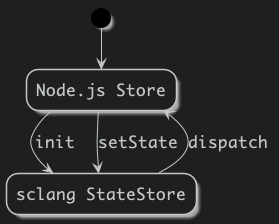

# supercollider-redux

[](https://travis-ci.com/colinsullivan/supercollider-redux)

A library for state synchronization between SuperCollider and Node.js using the [Flux design pattern](https://facebook.github.io/flux/docs/in-depth-overview/).  State flows from a primary state store in Node.js to a replica in SuperCollider which can dispatch actions back to the Node.js store.

## How it works
Intended for use with a primary state store in Node.js implemented with [Redux](http://redux.js.org/).  Provides `StateStore`, a replica state store in [SuperCollider](http://supercollider.github.io/) which leverages [supercolliderjs](https://github.com/crucialfelix/supercolliderjs) and the [API quark](https://github.com/supercollider-quarks/API) to receive state changes.

The Node.js class `SCStoreController` forwards state updates to a replica running in sclang and receives actions dispatched from it using a separate OSC channel.



When actions are dispatched from sclang to the replica `StateStore` instance, they are passed up to the primary Node.js store via OSC, any reducers written in Node.js can update the state which will then be forwarded back to the replica.  The primary / replica design promotes all state changes written as reducers in Redux, centralizing the state in the Node.js process.

## SuperCollider API
All SuperCollider code is included in a [quark](http://doc.sccode.org/Guides/UsingQuarks.html) inside the `quarks/supercollider-redux` directory.

### `SCReduxStore`
Implements the state store replica in SuperCollider.  Usage:

```supercollider
var store = SCReduxStore.getInstance();

// Subscribing to state changes
store.subscribe({
    var state = store.getState();

    // This method is called whenever state changes.
});


// Dispatching a message to the Node.js store
store.dispatch((
    type: MyActionTypes['HELLO_WORLD'],
    payload: (
        hello: "world"
    )
));
```

Other classes:
* `SCRedux`: Used as a namespace for storing constants like actionTypes.
* `SCReduxTempoClockController`: A wrapper for TempoClock which will take a tempo from the Redux store.

## JavaScript API
### `reducer`
A reducer is provided to store the ready states of the SCReduxStore, sclang, and scsynth:

```javascript
import SCRedux from 'supercollider-redux';

const rootReducer = combineReducers({
  [SCRedux.DEFAULT_MOUNT_POINT]: SCRedux.reducer,
  ...
});
```

### `SCReduxController`
A controller class that starts sclang and initializes the SCReduxStore.

```javascript
import SCRedux from 'supercollider-redux';

const scReduxController = new SCRedux.SCReduxController(store);

scReduxController.boot().then(() => {
    ...
}).catch((err) => {
    ...
});
```

Parameters may be passed:

* `scStateSelector`: An optional selector (intended use with [reselect](https://github.com/reduxjs/reselect)) to control which portion of the state tree is passed to `SCReduxStore` in SuperCollider.  This will be an important performance consideration in any application.
* `interpretOnLangBoot`: A string containing SuperCollider code for sclang to interpret immediately on boot.  This is important to, for example, indicate which audio device to use.

```javascript
const controller = new SCReduxController(store, {
    interpretOnLangBoot: `
s.options.inDevice = "JackRouter";
s.options.outDevice = "JackRouter";
    `,
    scStateSelector: mySCStateSelector
});
```

### Constants
#### `READY_STATES`
An enum with the possible values for the ready states of `scStoreReadyState`, `scLangReadyState`, `scSynthReadyState`.


## Example Projects
* [Transdimensional Audio Workstation](https://colin-sullivan.net/main/2016/transdimensional-audio-workstation/)
* [Touch UI to Generative Music Sequencer in SuperCollider](https://colin-sullivan.net/main/2019/performance-environment/)
